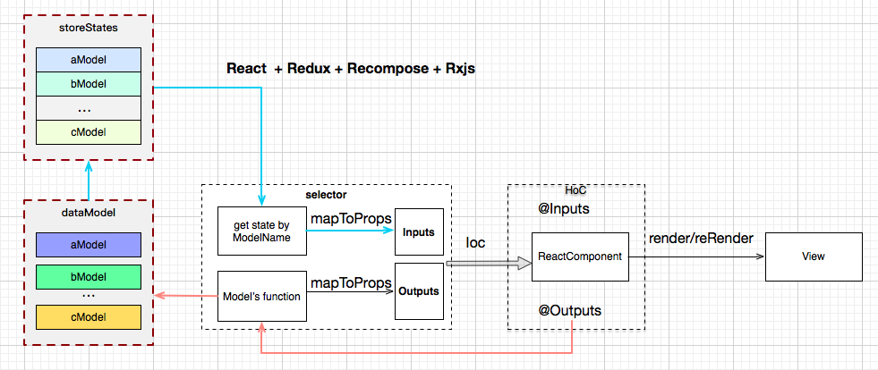
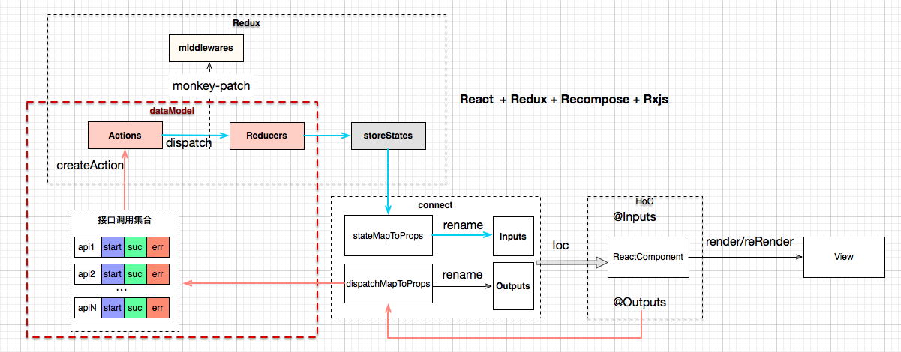
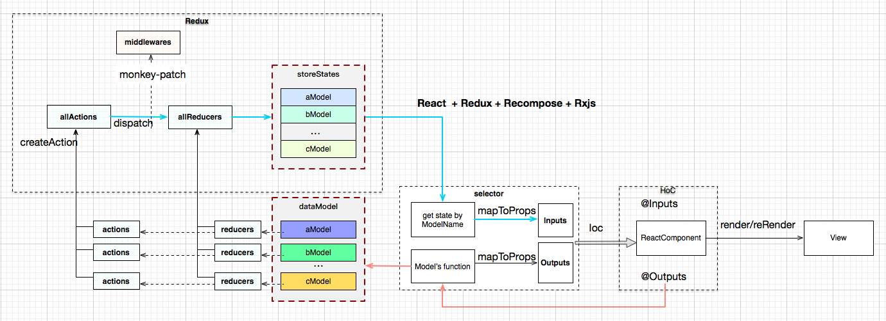

# Damo的核心代码Core

### 核心代码架构

Damo是一套完整前端开发框架，通过JSX和JavaScript编译成JavaScript的语言，来构建客户端应用。

该模块是Damo的核心代码库，搭配Redux来完成更好的状态应用和管理。以下是核心代码库的架构图：

如果觉得很陌生，可以先了解下下[Redux](https://github.com/reactjs/redux)，同时结合以下Redux的架构图来理解。

可以从Redux演变过来的核心代码库，从中发现其中的关系。

### 资料参考

1. [react](https://github.com/facebook/react), React是一个用于构建用户界面的JavaScript库，是一套高性能的组件框架。
2. [redux](https://github.com/reactjs/redux), Redux可以理解为Flux模式的一种实现，弱化了dispatcher的概念，强化了reducer概念。Redux是JavaScript状态容器，对应用提供可与预测化的状态管理。
3. [react-router](https://github.com/reactjs/react-router), ReactRouter是一套路由管理方案
4. [history](https://github.com/mjackson/history), History是浏览器history增强库，更好管理H5的路由状态。
5. [redux-react-router](https://github.com/reactjs/react-router-redux), Redux和Rrouter结合的一个库。
6. [reselect](https://github.com/reactjs/reselect), 对Redux状态数据进行二次缓存和读取，减少不必要的数据驱动更新行为。
7. [recompose](https://github.com/acdlite/recompose), Hoc的封装工具类库。
8. [rxjs](https://github.com/ReactiveX/rxjs), RxJS是基于响应式编程实现的JavaScript高性能库，提供管理复杂异步应用非常优秀的方案，RxJS是一个包含丰富数据变换的函数库。
9. [events](https://github.com/Gozala/events), 事件驱动器。
10. [react-intl](https://www.npmjs.com/package/react-intl), 基于intl的国际化。
11. [seamless-immutable](https://www.npmjs.com/package/seamless-immutable), 封装不可变的数据接口，使得Redux的状态数据更加可靠。
12. [isomorphic-fetch](https://www.npmjs.com/package/isomorphic-fetch)），通过ES的fetch接口来调用接口，更加规范和高性能。